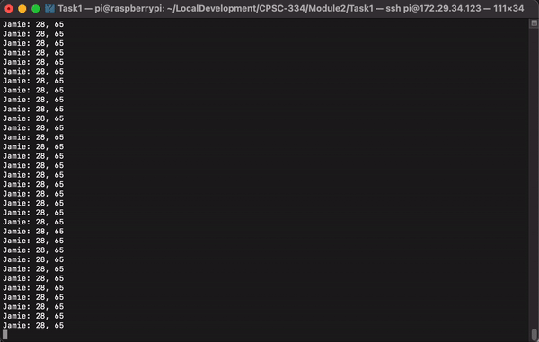

# Module 2, Task 1: Interactive Devices

## Task Description
This first task of this Interactive Devices module aimed to increase familiarity with the given hardware by requiring a creative solution to a resource-constrained problem. Namely, my solution had to meet the following design constraints:
- Utilize exactly the three given sensors: a momentary button, a SPST switch, and an analog joystick.
- Demonstrate three different modes of operation, i.e. states of the system that alter the effect an input action has on the output, directly via user input
- Have some digital output, audio, or video.
- Must operate on the Raspberry Pi using the GPIO pins.

The two primary challenges are to:
1. Use the analog joystick input with the strictly digital pins of the Raspberry Pi.
2. Manage switching between three state with only one binary switch.

## Marco Polo: A Classic Pool Game Brought to the Terminal
In preparation for a variety of game ideas for Task 2 of this module, I used Task 1 to address the idea of movement within a space via the joystick. However, due to time constraints and a focus on the physical circuitry, I decided to focus on simple terminal output rather than any sort of complex visual or audio output.

Therefore, I turned to the classic pool game Marco Polo, which is essentially a variant of tag. More specifically, one player is designated at *Polo* and has to close their eyes to look for all the other players (the *Marcos*) who have their eyes open. Whenever the searching player calls out for *Marco*, all the other players must shout back *Polo* so that the searcher can find them by voice.

[Link to YouTube video demonstration (do watch for important background)](https://youtu.be/zjoAy5AJkwY)

This terminal version flips the script somewhat, with all the other players "blindly" searching for the first player, the *Marco*. However, the same basic idea applies, and it turns out to be a fun, if flawed, way to experiment and address movement in a two dimensional space using the given components.

## Usage Instructions

### Running and Setup
To set up this repository for local use, you need to
- Create a replica circuit connected to a Raspberry Pi like the one described below.
- Have an installation of Python3 with the *gpiozero* library installed.
- Download the code to your local computer (either using git clone or by downloading a .zip folder).
- Open a terminal and move to the project directory.
- Modify the gameplay constants in *final.py* if desired using a text editor.
- Flip the switch to the off position to start (black wire).
- Run the code using *python3 final.py*.

### Gameplay
In order to actually play the game, get two or more players and use the rules outlined below.
- When prompoted, input the number of people playing.
- Input the names of each of the players (**note:** player 1 will be the *Marco* who is searched for).
- Give the first player control of the inputs and have the other players look away while they play their turn, choosing a hiding spot away from the other players.
    - Flip the switch to the on position (red wire).
    - Move the joystick to the right and/or up to increase the x and y positions, respectively. By default, each of the values will decrease (due to the digital joystick input). The current coordinates will be continaully printed to stdout.
    - Flip the switch to the off position to pause or stop. You are allowed 5 moves to nail down a hiding spot for this round.
    - Press the button to move to the next player.
- Let each of the searchers take their turn individually without the others watching, looking for a spot within 15 of Marco.
    - Flip the switch to the on position (red wire).
    - Move the joystick to the right and/or up to increase the x and y positions, respectively. By default, each of the values will decrease (due to the digital joystick input). The current coordinates will be continaully printed to stdout.
    - Flip the switch to the off position to pause or stop at a guessing position.
    - Look at the given proximity output and consider which direction to move for your next guess. You are allowed 5 guesses each round and are aiming to get within a distance of 15 of *Marco*.
    - Press the button to move to the next player if satisfied/out of turns.
- Repeat the last two major steps for as many rounds are necessary until *Marco* is found (within a distance of 15).

[Full length, high quality gameplay demonstration via *ssh*](assets/gameplay_screen_recording.mov)

## Implementation Details

### Physical Design
As required, this project uses a physical control circuit connected to a Raspberry Pi for user interaction, including
- A momentary button for switching players
- A SPST switch for turning movement on or off
- An analog joystick

All of these components were wired to GPIO pins of the Raspberry Pi as well as the required power/ground values in order to function as desired. Namely, it used the following connections (which are fairly evident from the code):
- Button: one pin to GND from the Pi and the other to GPIO 2
- Switch: one pin to GND from the Pi and the other to GPIO 3
- Joystick: VRX to GPIO 14, VRY to GPIO 15, +5V to 5V from the Raspberry Pi, GND to GND from the Pi, and SW to GPIO 4

### Languages and Frameworks
This project uses a basic Python installation on a Raspberry Pi running Raspian. In addition, it uses the following libraries:
- *gpiozero* for the *Button* class to take digital inputs from the circuit
- *os* for *system* to clear the terminal screen
- *math* for *sqrt* to calculate distance

### File Structure
- *READMe.md* (read for instructions) describes all aspects of the project and game.
- *final.py* contains the final Marco Polo terminal game.
- *assets* contains the images and videos used in *README.md*
- *old_stuff* contains previous attempts at various sub-parts of the game code, as well as for several other ideas outlined below.

## Approach Analysis

### Benefits
- As opposed to more complex solutions with audio or visual output, this can be run on the default Pi configuration via *ssh* on any computer.
- Beyond just 3 states as required, this program can work with any number of players, each of whom creates their own state.
- This game uses all the inputs in a fundamental manner that can be replicated in a great variety of other games, regardless of the number of players.
- The circuit and code based on the *gpiozero* library can be easily modified to play the game according to slightly modified rules.

### Downsides
- While simple and fun, the exclusively terminal-based output is not as engaging as a visual one nor does it test any of the graphical components I plan to use in Task 2 (most likely vis *pygame*).
- The *gpiozero* library does not provide as detailed of control as others like *RPi.GPIO*.
- The circuit itself is relatively fragile and difficult to use without some sort of enclosure.
- Trying to use the joystick as a full 2-axis input via digital input is very difficult and makes moving your character difficult. I tried to address this with pull-down resistors altering the resting state, but it just seems impossible to get the desired 3 states (e.g. left, resting, right) with a binary digital input.

[Link to video demonstration of the frustration caused by joystick oddities late at night...](https://drive.google.com/file/d/1k-CLAhUNHLnZfPEp-Tc-I_WQrhwyUld9/view?usp=sharing)

## Abandoned Ideas
While some of these ideas may return in Task 2 in some form, most of them were just too much to learn/focus on for the time and scope of the first task. These ideas (many of whose code is included in the *old_stuff* folder) included:
- An audio jukebox using *playsound* or *pygame* to manage the audio streams
- A *Processing* artpiece resembling a digital Etch-a-Sketch
- A simple *pygame* game on the path to a more complex game for Task 2

## Future Plans
In the future, this game could be greatly expanded in a number of ways to further replicate and even go beyond the physical pool game on which it is based. Some of these potential improvements are outlined below.
- Instead of being terminal-based, this game could use a library like *pygame* to provide graphical output. In this version, maybe the *Marco* could disappear until called and send out some kind of message or visual waves indicating the other players' distances from the target.
- By adding more hardware, namely additional joysticks, players could actually play at the same time and chase each other like in the real game.
- Even staying within the terminal, some sort of analog-to-digital converter could be used to get more accurate input along both directions, a basic playability limit of this version.
