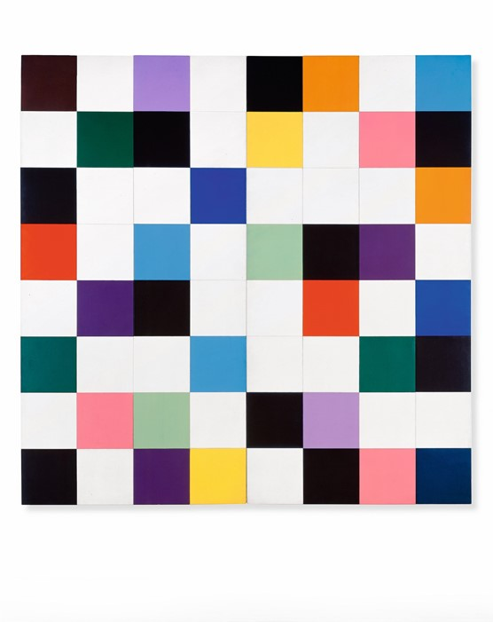
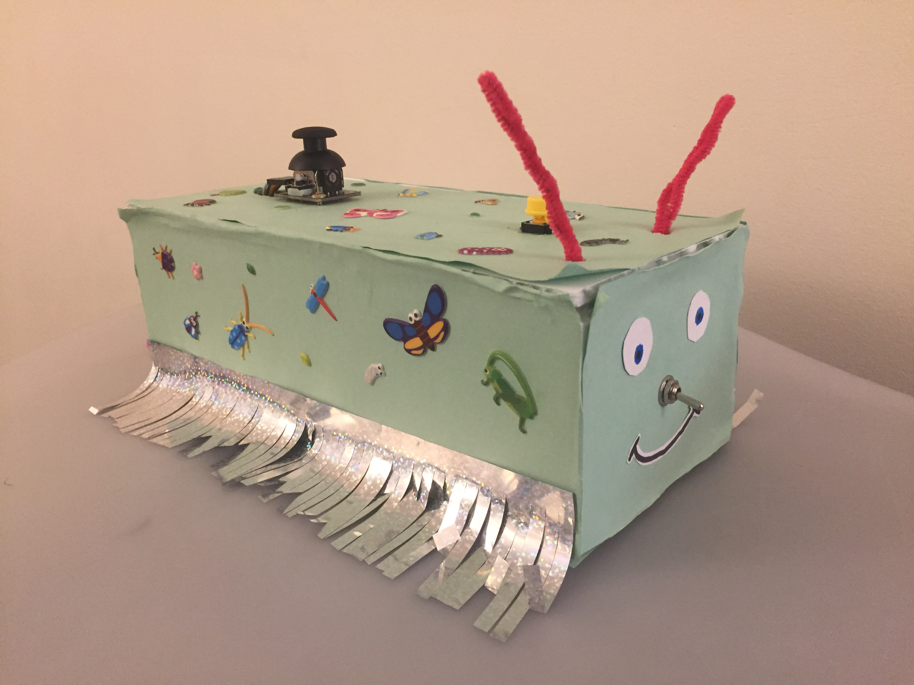
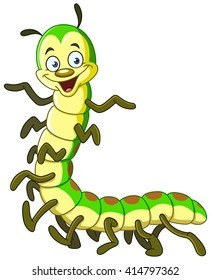
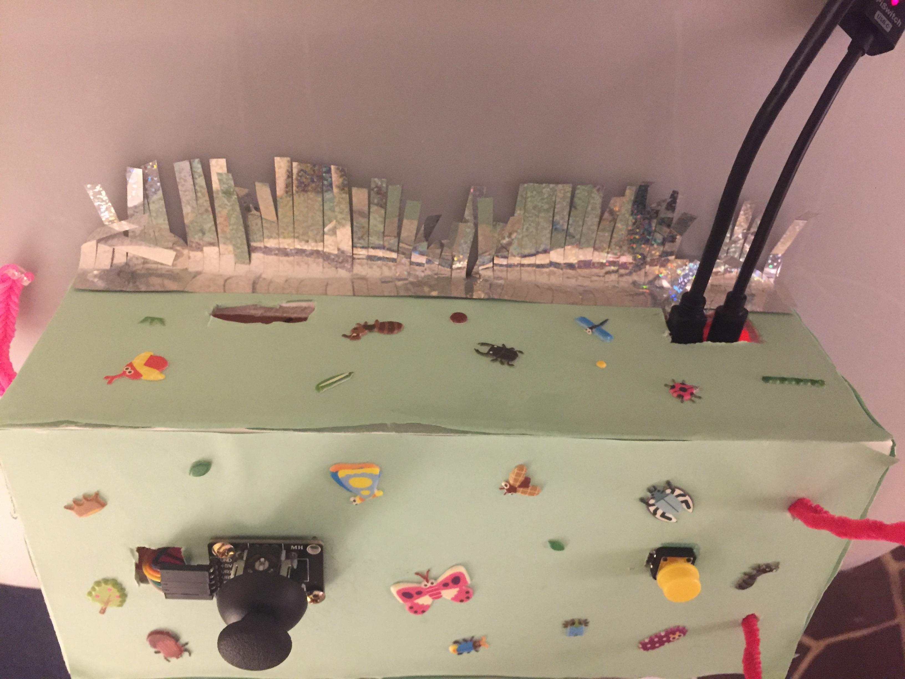
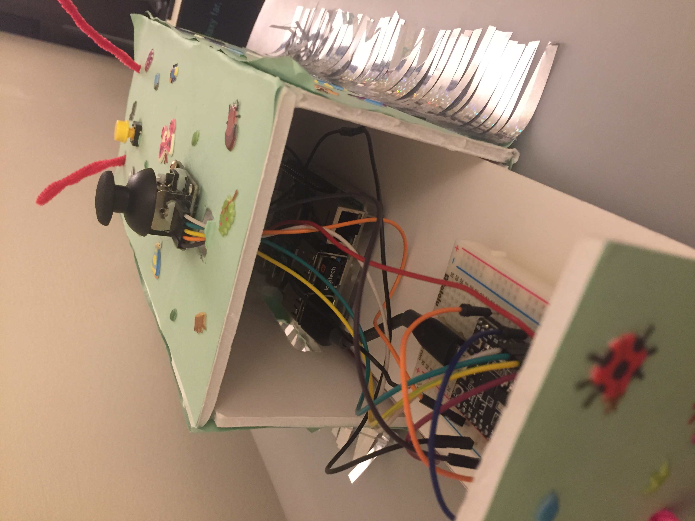
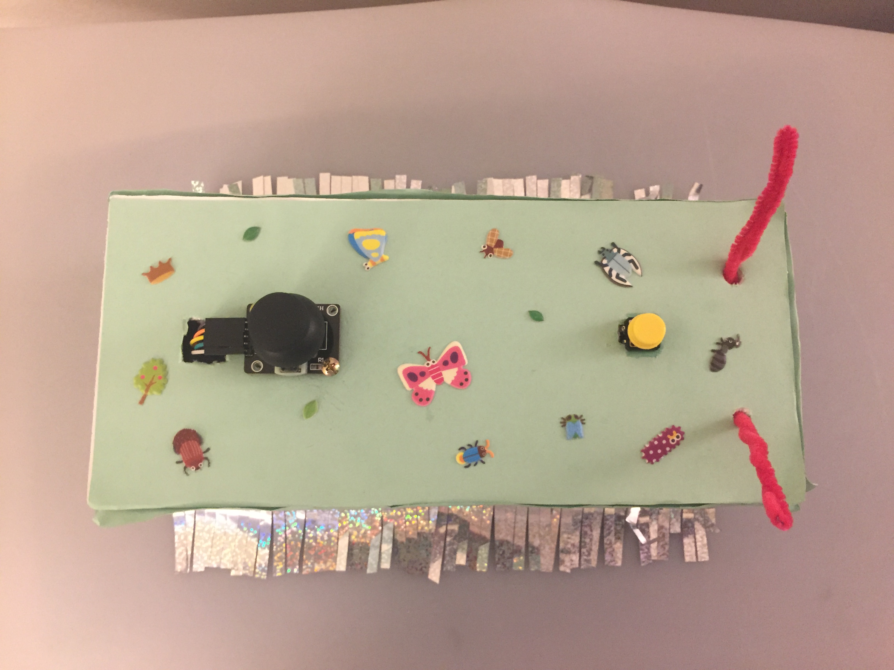
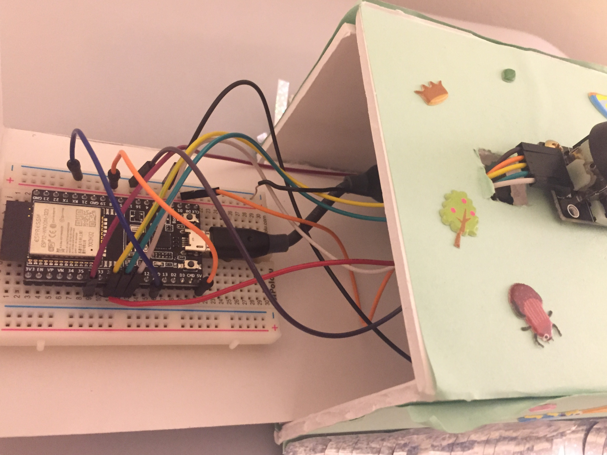

# Module 2, Task 2: Interactive Devices

## Task Description
The second task of this Interactive Devices module aims to take the experience from Task #1 and apply it to build a "performable" device (e.g. a digital instrument or game console). As in the previous task, the device must:
- Utilize exactly the three given sensors: a momentary button, a SPST switch, and an analog joystick.
- Demonstrate three different modes of operation (i.e. states of the system that alter the effect an input action has on the output) directly via user input.
- Have some digital output, audio or video (monitor, mini-screen, etc.).

However, instead of requiring use of the Raspberry Pi, the device:
- Must use the ESP32 (or any other Arduino-style microcontroller) and may additionally use the Raspberry Pi.

With the additional constraints that it:
- Must have an enclosure or enclosures.
- May use as many LEDs as desired.

## CentESPede 32: An Artistic Reinterpretation of a Classic Arcade Game
Building off the basic motions established in Task #1 for Marco Polo, I wanted to create a more interactive game for Task #2. To do so, I turned to classic arcade games, which seemed approachable to make and would allow for the creation of attractive visual artifacts. In the end, I decided on the Atari and arcade classic Centipede due to the abundant opportunities for colorful and persistent items.

For artistic inspiration, I wanted to replicate the simple, primary colors of modern artists like Jackson Pollack and Ellsworth Kelly. In specific, I utilized the colors from Kelly's *Colors for a Large Wall* (1951) as the basis for the obstacles and sprites in my game. Additionally, rather than using more intricately-designed sprites that replicate the original game, I stuck to simple/fundamental shapes of those colors. Thus, when the gamestate is saved via the built-in screenshot tool, it produces its own work of "art" in this style.

## Usage Instructions

### Running and Setup
To fully set up this repository for local use, you need to
- Create a replica circuit with some computer connected to an ESP32 like the one described below (or run in the stripped-down *--keyboard* mode described below).
- Have an installation of Python3 with the libraries listed below installed on your Raspberry Pi or computer.
- Download the code to the Pi or computer (either using git clone or by downloading a *.zip* folder).
- Plug in the ESP32 either to the Pi (inside the enclosure) or your computer, and plug the Pi (if using it) to power and a screen if desired.
- Open a terminal and move to the project directory.
- Run the code using *python3 centipede.py* with no argument for a Mac installation and *--pi* for a Raspberry Pi (based on serial ports - which you may want/need to modify or hardcode for your own system), with an additional optional argument *--keyboard* for purely keyboard-based operation (makes the game runnable on a reegular computer without an enclosure).

Additionally, to further refine gameplay for your specific skills and setup, you can modify the following top-level constants in the *centipede.py* code:
- *WIDTH, HEIGHT* in order to change the default window size (set to 480, 640 to best match the original arcade game at a decent resolution)
- REP_COUNT to modify the processing of ESP32 inputs, with higher values representing a larger number of input values averaged to decrease randomness

In the *game* function, you can modify:
- *lives* to change how many lives you have before losing
- *psize* to change the player sidelength
- *pvel* to change the player velocity
- *cvel* to change the centipede velocity
- *csize* to change the radius of the centipede segments
- *lvel* to change the laser velocity when shot
- *ocount* to change the number of obstacles spawned initially

And finally in the *Player* class, you can modify:
- *COOLDOWN* to change how long the player has to wait in between shots

### Gameplay
Like the original game, the objective of this version is to shoot all the segments of the centipede. Here, you play as the navy square and aim for the green circles, which move together until divided. The obstacles, which have the aforementioned colors, will block movement and shots (which progressively shrink them), while redirecting the centipede segments. The game is intended to be played directly from the enclosure, you can also use a keyboard for input if desired, with both control schemes outlined below.
- Click the yellow button on the enclosure or the touchpad/mouse on the computer while on the main menu to start gameplay.
- Flip the Centipede "nose" switch or press the *p* key to pause/unpause (up is paused, down is unpaused).
- Use the joystick or the arrow keys to move the blue square around so that you can shoot the centipede and avoid hitting its segments. Note that you can only move in the bottom portion of the screen, where the centipede also stays once it enters.
- Press the yellow button or the spacebar to shoot lasers at the centipede (can be held for auto-reload).
- Click the joystick button or the touchpad/mouse to take a capture of your current game state as archival art (copy them from the screenshots folder or change the save location in the code if desired to avoid rewriting).
- Continue playing until you lose all 3 lives.

For competitive play, consider playing for the highest number of centipedes defeated or, more simply, the highest score. This may require some modifications of the constants described above to fine-tune the difficulty level for your skills.

## Implementation Details

### Enclosure

As a play on the concept and title of the game, I decided to make my enclosure resemble a cartoon centipede, using the image below in specific for inspiration and colored paper to match the game sprite. While the joystick and button are more utilitarian, other parts of the enclosure, like the "tail" for opening the drawer and the "nose" switch for pausing seamlessly fit the centipede design. I additionally decorated with some stickers and "legs" to further enhance the look.

For ease of construction, I utilized a foam board, cutting six sides to form a rectangular prism that could enclose the ESP32 and Pi together. However, to enable access to the internal circuitry, I made the lefthand side a "drawer" that could slide out, as shown in the picture below.

There are two different ways of connecting the circuit to play the game: via the built-in Raspberry Pi or via your local computer. There is a short micro USB to USB A cable to connect the ESP32 to the Pi, as well as a cutout on the back for connect a USB C power source and a micro HDMI display output. For computers, there is a cutout to plug in a longer micro USB to USB A cable for attaching the ESP32 to a computer instead.

Inside, the Pi is mounted on the right and the breadboard on the left using velcro command strips (to allow for easy removal). All the circuitry is contained inside the enclosure, with most of the wires going between input and the broadboard.

All the input devices are mounted onto the box, with the switch being cut into the face, the joystick being screwed into the top, and the button being just stuck into the top (one of the more flimsy parts of the design).

### Circuit Design
As required, this project uses a physical control circuit connected to a ESP32 for sensor data, including:
- A momentary button for shooting
- A SPST switch for pausing
- An analog joystick for player movement

All of these components were wired to GPIO pins of the ESP32 as well as the required power/ground values in order to function as desired. Namely, the circuit used the following connections (which are fairly evident from the code):
- Button: one pin to GND from the ESP32 and the other to GPIO 33
- Switch: one pin to GND from the ESP32 and the other to GPIO 32
- Joystick: VRX to GPIO 25, VRY to GPIO 26, +5V to 5V from the ESP32, GND to GND from the ESP32, and SW to GPIO 27

### Languages and Frameworks
This project uses a basic Python installation on a Raspberry Pi running Raspian. In addition, it uses the following libraries:
- *pygame* for all the game features and logic
- *serial* to communicate with the ESP32
- *threading* to implement the multi-threading needed to constantly take ESP32 input while updating the game
- *sys* for a command-line argument to run on either the Pi or a Mac (from the serial port)
- *os* for *path* to write the files to a folder
- *random* to randomize obstacle-spawning

To share sensor data from the aforementioned input devices, this project also uses an arduino sketch and writes the data to the serial port as comma-separated values using *Serial.print*.

### File Structure
- *README.md* describes all aspects of the project and game.
- *centipede.py* contains the final Marco Polo terminal game.
- *input_value_reader* contains the *input_value_reader.ino* sketch that should be uploaded and run on the ESP32 to read input values.
- *screenshots* is the folder into which the screenshots will be saved (can modify so that they do not save over each other).
- *assets* contains the images and videos used in *README.md*.
- *old_stuff* contains previous attempts at various sub-parts of the game code, as well as for several other ideas outlined below.

## Approach Analysis

### Benefits
- The enclosure is relatively sturdy and attractive without being too laborious to make or work with.
- The game is easily playable without additional hardware (outside of a display) and accurately represents the original vision.
- The visual artifacts left in the screenshots are actually quite attractive.
- *pygame* was easy to work with and very powerful.

### Downsides
- While conveniently-packaged, the enclosure was certainly difficult to work with while designing and debugging.
- The enclosure is still a bit fragile and has some rough edges.
- The code runs with a good amount of lag on the built-in Pi (though not on a computer which is a valid option).

## Abandoned Ideas
While most of the original ideas were achieved in this Task, there were a few unrealized goals, namely:
- Creating an enemy sprite that moves around the player area to emulate the spider in the original game.
- Adding a high score function.
- Differentiating the different "levels" somehow so the players have some sense of progress, e.g. via colors, backgrounds, speeds, etc.

None of these ideas are much more challenging technically, so they could definitely be implemented with a little bit more time.

## Future Plans
In the future, I would like to further refine the enclosure design to be more sturdy and attractive. My initial thoughts would be to:
- Make the box out of lasercut wood rather than foam core.
- Paint the box instead of wrapping it with paper.
- Use a more satisfying and precise joystick and button.
- Provide some easier way to access the electronics inside the box (maybe via a removable lid).
- Separate the parts into several small modules in case the Pi was not desired, which could further the "centipede" appearance.

In terms of the code, I would probably turn to the unrealized ideas above, which shouldn't take too long, as well as refining player and centipede movement (mostly by refactoring the Centipede and Segment classes so that the centipede splits more properly). With the side effect of transforming the project, it could also be modified to play different games. I could maybe even link multiple enclosures together via wires or bluetooth to play games with multiple players (competitive Centipede here we come)!

## References
As this was my first time using pygame, I turned to some YouTube tutorials, namely this implementation of ["space invaders"](https://youtu.be/Q-__8Xw9KTM) and a [two-player space battle game](https://youtu.be/jO6qQDNa2UY) from [Tech With Tim](https://www.youtube.com/channel/UC4JX40jDee_tINbkjycV4Sg), which I used for the basic structure of my program. Additionally, I used the [official pygame documentation](https://www.pygame.org/docs/) and the following sites:
- [This stack overflow](https://stackoverflow.com/questions/7168508/background-function-in-python) for learning about multithreading.
- [This stack overflow](https://stackoverflow.com/questions/17267395/how-to-take-screenshot-of-certain-part-of-screen-in-pygame) for how to take screenshots of your pygame program.

In terms of the circuitry and electronics code, I referenced the following pages, as well as the official class documents:
- [This tutorial](https://randomnerdtutorials.com/installing-the-esp32-board-in-arduino-ide-windows-instructions/) for working with the ESP32 in Arduino IDE.
- [This documentation](https://microcontrollerslab.com/esp32-pinout-use-gpio-pins/) for the ESP32 GPIO ports.
- [This article](https://www.elithecomputerguy.com/2020/12/arduino-read-serial-communication-with-raspberry-pi/) on reading serial communication on Raspberry Pi (and Python in general).

Finally, as mentioned before, I took inspiration from:
- The [Wikipedia page](https://en.wikipedia.org/wiki/Centipede_(video_game)) for Centipede to learn about specific game properties.
- [This implementation](https://games.aarp.org/games/atari-centipede) of the game for at-home gameplay comparisons.
- [This game recording](https://youtu.be/V7XEmf02zEM) for quick visual comparisons.
- [This listing](https://www.walmart.com/ip/Centipede-Arcade-Machine-Arcade1UP-4ft/617089098) for the original cabinet design (also included in the blogpost).
- Ellsworth Kelly's [Colors for a Large Wall (1951)](https://www.anothermag.com/art-photography/10975/five-things-you-might-not-know-about-ellsworth-kelly) for colors and design (and the image above).
- The centipede on [shutterstock](https://www.shutterstock.com/search/centipede+cartoon) for my enclosure design.
