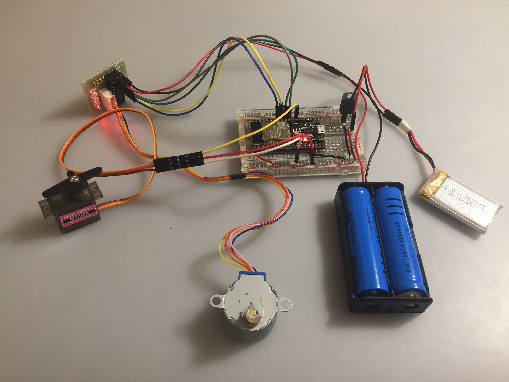

# Module 4/5, Task 1: Kinetic Sculpture

## Task Description
This first task of this Kinetic Sculpture module is primarily a technical exercise to gain familiarity with the hardware for the assignment, namely the following actuators
- 28BYJ-48 Step Motor
  - With ULN2003 Driver Board
- MG90S Micro Servo Motor

To do so, this task implements a circuit connecting the stepper and server motors to an ESP32, with code such that every time the stepper motor rotates 360 degrees, the servo rotates 10 degrees, resetting to 0 degrees once it reaches 180 degrees.

## Implementation Details

### Physical Design
Along with the 28BYJ-48 step motor, its ULN2003 driver board, and the MG90S micro servo motor, the circuit used a cluster of two 18650 LiPo batteries to power the step motor and a 600mAh LiPo battery to power the ESP32 and server motor. The specific circuit details are outlined in the diagram below.

### File Structure
- *README.md* (read for instructions) describes all aspects of the circuit and code for the task.
- *final/final.ino* contains the final motor control code.
- *assets* contains the images and videos used in *README.md*.

## Usage Instructions
To use this code, merely create a circuit that mirrors the one from the diagram above and load the ESP32 with the *final.ino* sketch. Then, watch the motors move according to the spec, as shown below.

## References
To complete this task, I mainly used two Random Nerd Tutorials: one for the [stepper motor and driver](https://randomnerdtutorials.com/esp32-stepper-motor-28byj-48-uln2003/) and one for the [servo motor](https://randomnerdtutorials.com/esp32-servo-motor-web-server-arduino-ide/). Additionally, for the code, I used [Jarek Paral's ServoESP32 library](https://github.com/RoboticsBrno/ServoESP32/tree/master/examples).
