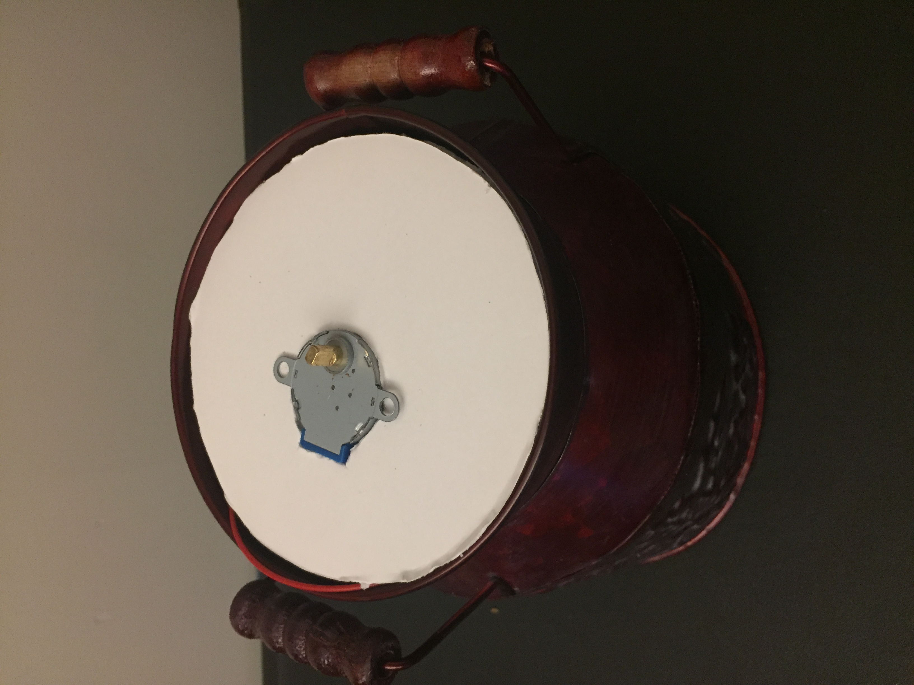

# Module 4/5: Kinetic Sculpture

## Task Description
This module requires actuation of the physical world, namely through one of either:
1. kinetic sculpture
2. interactive kinetic art
with the difference being integration of user input into the work.

Task #2 in specific asks to use the experience from the motor control in Task #1 to build kinetic art, using a subset of the following components:
- 28BYJ-48 Step Motor
- SG90 Tower Pro MicroServo
- NW Powerful 6x14mm Micro Vibration Motor 1.5V-4.5V 0.195A 19000RPM
- DC Brush motor

specifically at least the stepper and servo motors (or alternatively one of these and the other two motors). The device may use as many motors available and additionally must have an enclosure (or enclosures) that is safe to operate over long periods of time.

## *Evertree*: An Interactive Wire Sculpture

The idea for this project came from a combination of various desires, interests, and inspirations, namely:
- replicating the kinetic mobiles of Alexander Calder
- creating a metal wire sculpture like those commonly made of various animals, peoples, etc.
- building on the wireless communication of the previous module in a lower latency manner
- emulating the wireless "magic" of the Wii remote

In the end, I combined these ideas to create the *Evertree*: a spinnning wire sculpture controlled by a wireless remote. This basic structure harnesses the aforementioned magic of wireless communication to emulate the experience of using a Wii remote, while utilizing the kinetic motion of Calder sculptures to create an added element of dynamism. Furthermore, when it spins, the various "leaves" of the *Evertree* transition between the four seasons, demonstrating the flow of time and the endless birth and rebirth of nature. Ultimately, this combines to make an engaging and beautiful art piece, one that is simulataneously technological and natural.

## Implementation Details

### Tree and Adornments

While I initially focused on the aforementioned Calder-like mobiles or realistic replications of objects and animals, as soon as I saw an example of a wire tree, I knew what I wanted to make. After some failed experimentation using the techniques in the YouTube videos linked below, I decided to start simply with my own process:
- braid two wires together from the middle to one end, leaving room for the roots at the bottom
- unbraid the top to create a sort of crinkled branch at the top of each wire
- combine these two braided pairs via a similar process, twisting them together while leaving room for the roots on the bottom and the "spread" of branches on the top
- continue to combine these branches by a factor of 2 each time until the desired density is reached, with the current version of the *Evertree* using 8 branches total
- twist together the roots in pairs (or more for bigger trees) using a similar process as for the branches

Beyond this algorithm, I also experimented with untwisting and bending the branches in different manners to replicate "outgrowth" of the tree. In the end, I was very happy with the visual appearance, and the fact that the design was based as much on my intuition and artistic expression as on the things I learned from YouTube was very gratifying.

For the base of the tree, I used a circular piece that I cut out of cork board using an X-Acto knife; for sizing this circle, I used the diameter of my pot enclosure (described below), shrinking it slightly to allow for a nearly flush fit that could still spin. To mount the tree in this base, I unbraided the very tips of the roots and stuck the resulting wires into the cork board, adjusting it so the tree stood upright. This created a strong but adjustable mount with a natural aesthetic perfect for a tree sculpture.

In terms of the tree "leaf" decorations, I started with the fall leaves, as I took inspiration from my favorite tree: the Japanese maple (above). To make leaves that replicated the deep reds of these trees, I used tissue paper that I cut into a simple leaf shape and "painted" with Mod Podge; these leaves were then attached by poking the wire through them twice and supergluing them in the resulting position. For winter, I used clear and light blue crystal beads to simulate icicles, putting them on a straight branch and crimping the end to stay on. Similarly, I used pink beads to create cherry blossoms, but this time I made an ellipse with the end of the wire to better evoke the bunches of flowers. Finally, I attached some fake grass with superglue to represent the bushy summer trees.

### Motor Circuitry
To rotate the tree, I utilized a similar configuration as in Task 1 of this module, namely:
- a 28BYJ-48 Step Motor for rotation
    - with a ULN2003 driver board for control of that motor
    - powered by a pair of 18650 LiPo batteries
- an ESP32-WROOM-32D for programatically driving the motor and receiving the ESP-NOW data (see below)
    - powered by a 600mAh LiPo flat pack battery regulated to 3.3V with a LD1117A regulator

By connecting these components as shown in the diagram below, I created a completely wireless circuit that could receive data from the remote control and rotate the tree accordingly.

### Drive System and Pot Enclosure
To connect the tree base and the motor, I needed some sort of drive system that could turn it consistently and smoothly, as well as some sort of enclosure for mounting the whole system. Initially, I considered using a laser cut wood box, with a driveshaft or gearing system connecting the motor to the tree base, which itself would be mounted on the box with lazy Susan turntable hardware (gearing sketch below courtesy of Julian Bernard).

However, after testing with several different sorts of drive systems, I realized that the tree base could be driven directly using the built-in stepper motor shaft. Furthermore, rather than a more generic box, I realized that I could further evoke my natural inspirations by placing it into a pot, and I found a perfect fall-themed one at the local florist.

While I was prototyping, I realized that each of my main components—-LiPo battery holder, breadboard with ESP32, and stepper motor—-fell into a different depth of the pot by the nature of their size, prompting me to consider a sort of "nesting doll" of electronics tiers. Ultimately, this design seemed both simple and functional, with the ability to store all my components using only hand cut foam core and cork board. After a few hours of cutting different sized circles to find the perfect diameters for each layer I ended up with not only a valid prototype but my end design for the enclosure.

While I was initially unsure about the materials and stability of this design, it was actually really solid, staying connected and even rotating while being carried around. In fact, given the chosen pot, I think the materials were actually ideal. In particular, rather than being a perfect circle, the opening of the pot is slightly bent, creating an inconsistent ovoid cross section. Whereas firmer materials like wood would have been either oversized or undersized, the pliable foam core was able to be squeezed into the available space for a tight interference fit. At the same time, it was easy to remove for charging, rewiring, etc. And while I initially was getting an inconsistent fit of the motor, sticking the motor wires through my measured cutout created a solid fit (even without screwing in the mounting points). Overall, while entirely different than many stages of my design process, the final enclosure was both beautiful and functional, with strong durability as well.

### Remote Control
For the remote control, I ultilized a similar set of components as for the motor control but with a focus on sensing instead of driving, namely:
- an MPU-6050 accelerometer/gyroscope for getting acceleration values
- an ESP32-WROOM-32D for programatically driving the motor and receiving the ESP-NOW data (see below)
    - powered by a 600mAh LiPo flat pack battery regulated to 3.3V with a LD1117A regulator
- a MG90S Micro Servo Motor for indicating the tilt direction

First, I had to test the MPU-6050 accelerometer/gyroscope, which I did using Adafruit's library for the Arduino IDE. The accelerometer readings seemed the most consistent and clear to me, as the acceleration due to gravity allowed for the calculation of the resting angle of the remote. For the chosen sensor position and an upright remote, I decided that the x-axis acceleration would best measure tilting the remote left and right, so I set thresholds in each direction with a cutoff value for making the stepper motor spin.

Beyond this initial design, once the tree and its enclosure was constructed, I decided to add a servo motor to the remote to signal when you have tilted it enough to activate the motor. To do so, it mirrors the action of the motor, tilting the attached *Homingbird* if the motor is spinning (right/left depending on clockwise/counterclockwise). That way, you have a more immediate form of feedback, especially useful given the extremely long range of the ESP-NOW protocol (as control could be "blind"). Additionally, this added a bit of character and fun to what is otherwise a pretty minimalist controller.

By conencting these components in the manner shown in the diagram below, I was able to create a fully wireless remote control that utilized tilt to control the tree rotation from afar.

In terms of the physical enclosure of the remote, I to used a plastic project box, both for speed and solidity of construction. It perfectly fit all my desired components: breadboard with ESP32 and MPU-6050, 600mAh LiPo battery, and micro servo with directional bird. I fastened everything down using Scotch restickable tabs, which held them down tightly but also allowed for repositioning and removal if necessary. This made it durable and easy to hold, but I still need to cut a hole/slot in the lid for the bird, so for now it is an "exposed" controller, which looks cool but definitely lessens the sense of hidden magic established in the main enclosure.

### ESP-NOW Connection
To connect the remote ESP32 to the motor control ESP32 and have the motor react in "real time" to the controller tilt, I implemented the ESP-NOW protocol, using a basic sender/receiver connection as described in [this tutorial](https://randomnerdtutorials.com/esp-now-esp32-arduino-ide/). This protocol is used to send the accelerometer values from the remote ESP32 to the one mounted in the tree enclosure, which processes them and decides if the x-values are high enough to indicate tilt levels causing motor rotation.

More specifically, both ESP32's are configured as WiFi stations, with all the accelerometer data being sent as a *C++* struct from the sender to the receiver. The sender ESP32 code implements an *OnDataSent* callback function to print the status of the sent packet/struct, while the receiver ESP32 code implements an *OnDataRecv* callback function to print and save the accelerometer values it receives from the remote.

Implementing this design turned out to be quite simple, with the main struggle coming in the synchronization of the messages and motor movement. To solve this, I tested several different delay values from the sender, as well as several different speeds. In the future, I may experiment with more combinations, but the current delay/speed pair creates movement that is both smooth and immediate to the remote inputs.

Notably, this connection included the biggest technical error in the project: an ESP-NOW watchdog error (below) that prevented the motor from making consecutive turns in a single direction.

After some research and deep dives into forums (linked below), I realized that this issue was due to the distribution of tasks to the 2 microprocessor cores. Specifically, it seemed that the empty loop function may be causing the ESP32 to reset after a certain number of data receipts. However, after trying to introduce prints, delays, etc. to loop to solve this, I realized that it may actually be my data receipt callback function that was stalling instead. When I added a delay(1) to this function, I no longer received the error, and I had a perfectly synchronized, fully wireless rotating tree.

### File Structure
- *README.md* describes all aspects of the sculpture, enclosure, circuitry, and code that makes up the project.
- *assets* contains the images and videos relating to the project, many of which are used in *README.md*.
- *final_receiver* contains the *final_receiver.ino* Arduino sketch that is uploaded to the stepper motor control ESP32 mounted in the pot enclosure.
- *final_sender* contains the *final_sender.ino* Arduino sketch that is uploaded to the remote control ESP32.
- *old_stuff* contains previous attempts at various sub-parts of the project, as well as for several other ideas outlined below.
- *remote.fzz* is the Fritzing circuit diagram for the remote control.
- *tree_driver.fzz* is the Fritzing circuit diagram for the stepper motor and control ESP32.

## Usage Instructions

### Running and Setup
To use an already-created *Evertree*, just make sure the batteries are charged and connected and that the remote is within range of the tree (as much as several hundred feed without interferences). To charge the two 600mAh LiPo batteries, disconnect them from the jumper cables and plug the built-in connecter to the given charging hub until the LED lights go out. To charge the 18650 battery pack, disconnect it from the circuit described above and connect the positive and negative leads to the *B+* and *B-* pins, respectively, of a *MakerFocus TP4056* charging board; then, connect the board itself to power via a microUSB cable and charge until the LED turns from red to blue.

To create your own rendition of the *Evertree*, you need to:
- create a wire tree with whatever process and design you desire
- replicate the remote control circuit
- create some sort of remote enclosure if desired
- load the remote ESP32 with the *final_sender.ino* sketch
- replicate the stepper motor control circuit
- create or find some sort of pot or enclosure for the tree
- mount the motor and tree in/on the enclosure
- charge the two 600mAh LiPo batteries and 18650 battery pack (as explaineda above)
- connect the batteries to both circuits and set up your enclosure for use

Then, the programs should run automatically on the ESP32, and you should have a working *Evertree* of your own creation!

### Interacting and Debugging

Actually using an *Evertree* is quite simple, as you merely hold the remote upright (with the *Homingbird* pointing upwards) and tilt the remote to the left or right to spin the tree. To know whether you are tilting the remote enough to meet the movement threshold, check whether the *Homingbird* is tilted in the same direction as the remote. If so, the tree should be rotating, and if it is not, one of the circuit connections is faulty or (more likely) one of the batteries is out of charge. To preserve battery for "active" periods of engagement, you can disconnect the battery and leave the *Evertree* in "idle" mode, making it a static sculpture for pure visual enjoyment instead.

## Future Plans and Improvement

### Expanded Features
In terms of the current design, I definitely had a few features that I did not have time to implement but could definitely integrate without too much trouble (and may in the coming weeks). These include:
- making a cutout in the project box lid for the directional indicator
- adding LEDs to the rotating platform (or the base) that light up depending on the remote angle and the angle of the stepper motor
- decorating the base according to the four seasons in addition to the branches
- making some kind of power switch for the batteries/motor
- improving cooling/airflow
- creating some kind of recharging circuit

The LEDs were definitely the feature I am most upset is missing, as all of the "seasons" on the branches really shine with concentrated light (pun intended). However, the already difficult packaging and spinning nature of the platform made even connecting some simple two-lead LEDs a significant challenge and large potential source of error (via twisted and tangled wires, electronic shorts, etc.). Furthermore, I am unsure that standard hobby LEDs would really get bright enough to shine through the fall leaves, sparkle the winter snow, etc. from so far below.

While the compact packaging and wireless design accomplished my original goals and added to the magic of the interactions, they were both at odds with my vision of an always-on mechanical plant, especially the constraints of the batteries. To be totally wireless, I needed batteries for the stepper motor as well as for the two ESP-32s, all of which could run out of charge without too much use. Meanwhile, due to the very tight packaging and tricky battery connections, it is a somewhat involved process to disconnect and recharge the batteries.

### Future Iterations
To solve these issues described in the **Expanded Features** section above, I think I would turn to another one of my designs: a variant in a larger pot or box that is connected to a wall outlet. Most immediately, I think I would use a square wooden pot also purchased from the florist, which would have much more room for airflow, charging/wiring holes, LED wiring, etc.

Rather than a replacement or iteration of the current design, I'd like to think of this as an alternate entry into the same collection. In fact, I think there are many viable and appealing variations on this design, some of which were included in my earlier considerations.

One of my other favorite possible iterations for future trees is based on one of those design experiments described above. More specifically, while the raised platform that resulted from the motor coupler (image above) did not fit my desire for hidden electronics, it did create a really cool elevated effect, and I could imagine creating some sort of multi-tiered rotating array of trees. I dubbed this my "Gardens of Babylon" idea, as it would trade the simplicity and elegance of the current design for the grandeur and complexity of a massive garden.

## Acknowledgements and Shoutouts
As one of my longer projects and definitely one that was most outside my traditional comfort zone, I definitely relied on the consultation with and ideas from people around me, from my mom's crafting skill to the CEID workers' machining knowledge. Specifically, I would like to acknowledge:
- **My mom** for ordering parts when I couldn't sign into our Amazon account
- **Scott** for helping me plan and sketch out my initial idea
- **Julian from the CEID** for providing construction assistance and advice throughout the design process
- **Blossom Shop** for providing affordable and beautiful pots with enthusiasm
- **Artist & Craftsman Supply New Haven** for helping me brainstorm ideas for the "leaves" on each of the seasons and providing the materials unavailable in the CEID

## References
Along with the above personal acknowledgements and interactions, the scope of the project required significant online research, and all of the sites utilized for the project are listed below.

### MPU-6050
[https://randomnerdtutorials.com/esp32-mpu-6050-accelerometer-gyroscope-arduino/](https://randomnerdtutorials.com/esp32-mpu-6050-accelerometer-gyroscope-arduino/)

### ESP-NOW
Introductions/How-To's
[https://randomnerdtutorials.com/esp-now-esp32-arduino-ide/](https://randomnerdtutorials.com/esp-now-esp32-arduino-ide/)
[https://randomnerdtutorials.com/esp-now-two-way-communication-esp32/](https://randomnerdtutorials.com/esp-now-two-way-communication-esp32/)

Watchdog Error
[https://github.com/espressif/arduino-esp32/issues/595](https://github.com/espressif/arduino-esp32/issues/595)
[https://github.com/espressif/arduino-esp32/issues/3871](https://github.com/espressif/arduino-esp32/issues/3871)

### Stepper Motor
[https://robocraft.ru/files/datasheet/28BYJ-48.pdf](https://robocraft.ru/files/datasheet/28BYJ-48.pdf)
[https://www.motioncontroltips.com/six-common-mistakes-to-avoid-when-specifying-and-using-step-motors/](https://www.motioncontroltips.com/six-common-mistakes-to-avoid-when-specifying-and-using-step-motors/)
[https://americas.hammondpowersolutions.com/en/resources/faq/definition/what-is-meant-by-class-in-insulation](https://americas.hammondpowersolutions.com/en/resources/faq/definition/what-is-meant-by-class-in-insulation)

### Wire Trees
Copper Wire
[https://youtu.be/MwH3uLq8yU0](https://youtu.be/MwH3uLq8yU0)
[https://youtu.be/RBMp3XaRw9I](https://youtu.be/RBMp3XaRw9I)

LEDs
[https://makeict.org/2018/01/07/diy-led-trees/](https://makeict.org/2018/01/07/diy-led-trees/)

Leaves
[https://createplaytravel.com/do-it-yourself/stained-glass-tissue-paper-leaf-sun-catchers/](https://createplaytravel.com/do-it-yourself/stained-glass-tissue-paper-leaf-sun-catchers/)
[https://liagriffith.com/painted-tissue-paper-leaves/](https://liagriffith.com/painted-tissue-paper-leaves/)
[https://www.youtube.com/watch?v=RpEa4Ve2IPo](https://www.youtube.com/watch?v=RpEa4Ve2IPo)