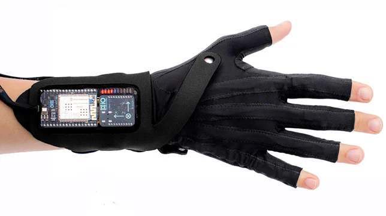
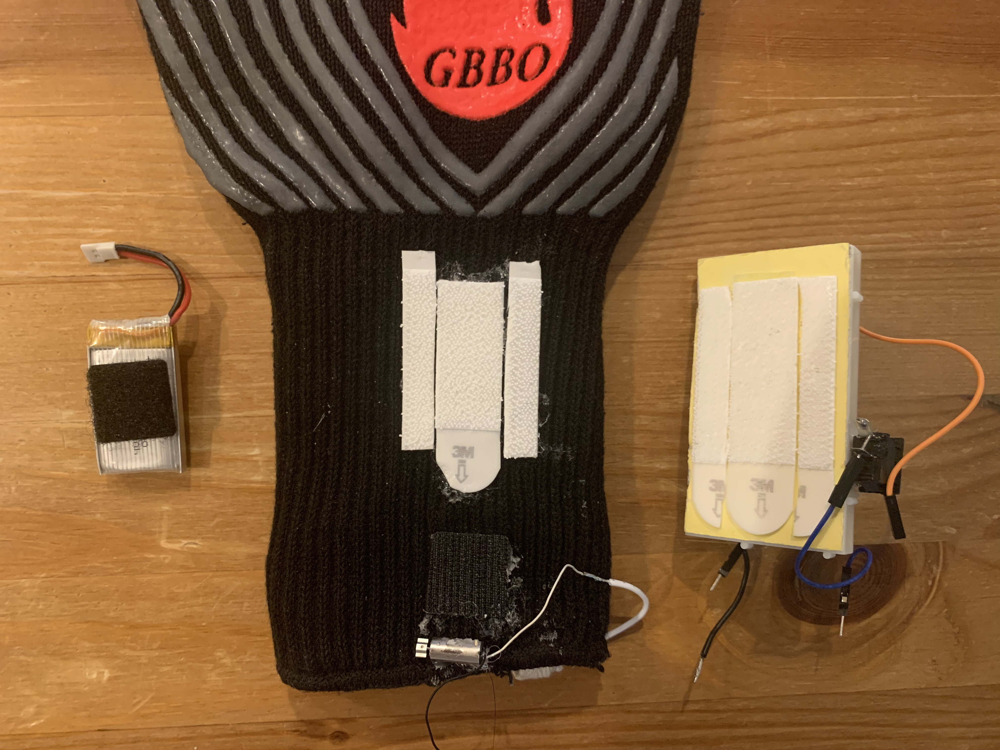
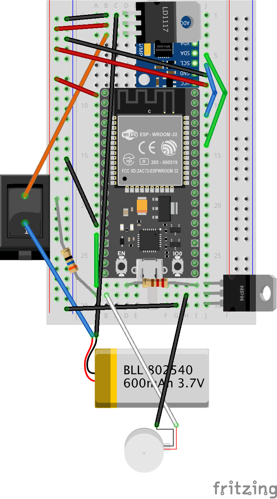

# Module 7: The Last Horrah


[Link to full-length demo video](https://youtu.be/5SbEfZnEtMI)


## Task Description
A culmination of the course, this project asks for some compelling combination of previous techniques and technologies to create a unique creative embedded system. In particular, it should use
- Raspberry Pi's, ESP32's, or some combination of both
    - some kind of I/O that differentiates these from a laptop or standard computer
- any subset of input devices, sensors, batteries, motors, wireless communication, or mesh networking
    - those available in the CEID or AKW
    - anything available for purchase online or in stores
- whatever construction methods necessary to execute the project design

In short, the task is to create something cool demonstrating mastery of the learnings from the semester.

Furthermore, the project must be able to be displayed in a 2-hour group exhibition in Leeds Studio, so it should either be interactive (and reliable across 2 hours) or be filmed ahead of time for observation in situ.


## *GBBO* and the *Gesture Glove*: An Interactive Motorized Ball
When I started to think of a final project, I knew that I wanted to incorporate my favorite parts of the previous projects. Namely, I wanted to create some sort of kinetic wireless system taking user input via sensors. Beyond this vague combination of technologies, I did not have any firm idea or vision for what I wanted to make. Thus, I turned to my favorite sources of inspiration: sci-fi and toys. First, I considered various movement-based remote control systems, namely:
- the telekinesis powers of the Force in *Star Wars*


- Microsoft Kinect's body-based gesture controls


- Imogen Heap's Mi.Mu music gloves



Then, I considered various objects that could be moved by these gestures, focusing on rolling balls in particular, namely ones like:
- BB-units like BB-8 from *Star Wars*


- Sphero toys


From this research and ideation, I created my design for *GBBO* and the *Gesture Glove*, a two-part system that allows for physical body movements to control the motion of a distant motorized ball. Going beyond a simple handheld remote, the *Gesture Glove* rests on a user's body, creating a natural form of interaction in the spirit of the Force or Microsoft Kinect. Meanwhile, the spherical design of *GBBO* evokes the onmidirectional fun of Sphero toys, with the personality of BB-unit droids. Ultimately, this design successfully combined the natural and the technical to create a unique sense of wonder through the simultaneous movement of your body and the ball.


## Implementation Details


### *GBBO*: Gyrating Ball Bot Object


The core part of my project, a remote control rolling ball in the spirit of a Sphero toy or BB-unit in *Star Wars*, was also the most complex to design, as I needed many different components to fit “perfectly” to allow for smooth movement. After looking at similar projects, I decided that a two-wheeled approach would be sufficient, where each wheel would have its own motor; that way, I could direct them both forwards, both backwards, or use a single one to turn clockwise or counterclockwise, creating a full range of movement without too much complexity. Luckily I was able to find a pair of gearbox DC motors with wheels specifically designed for small robotics projects, simplifying the “suspension” design.

From there, the most important thing was to select a correctly-sized plastic ball (transparent to create the aforementioned “cyber effect”). The key design problem was making sure it would fit the chosen wheels with a proper interference fit to allow them to “roll” the ball as they moved forward. This would effectively emulate the motion of a hamster ball, in which the movement of the wheels spins the ball while gravity keeps the drive system near to the ground. I ended up choosing a 200mm diameter ball for 65mm diameter wheels, which seemed like a good ratio for having enough room for the wheels to move yet enough breadth for them to drive the entire ball.


In order to have this perfect fit, I needed some way to mount everything within it. To do so, I cut a small piece of foam core that could hold the motors/wheels, along with all the circuitry to control it. By changing the length and width of this mounting board, I could change the fit of the wheels, allowing for some trial and error to get the desired drive characteristics. I ended up cutting this board such that it was just slightly shorter than the diameter of the ball and was wide enough for the wheels to sit about 1/4 of the way up the sidewall of the ball. With this chosen size, the only other modification I had to make for smooth driving was to lower the center of gravity by mounting two 7.4V battery packs (only one of which was actually used for power) on the underside, which stopped the wheels from driving up the sidewall and flipping over (a common problem in early testing).


The remaining planning was essentially just circuit design, which I mostly did on-the-fly based on my previous projects. However, since DC motors have current and voltage requirements beyond the capabilities of the ESP32 GPIO pins, I needed some sort of motor driver, and I turned to the very common L298N motor driver controller board, which incorporates two H-bridges to drive two motors via simple digital inputs from an ESP32. This board requires power for both the logic circuit and the motors, which came from a 7.4V 18650 battery pack and a 3.7V LiPo battery, respectively. The rest of the design was just connecting the input pins, which control the motors according to the following chart.

| Ball Direction | Input 1 (Motor 1) | Input 2 (Motor 1) | Input 3 (Motor 2) | Input 4 (Motor 2) |
| --- | --- | --- | --- | --- |
| Stop | 0 | 0 | 0 | 0 |
| Forwards | 0 | 1 | 0 | 1 |
| Backwards | 1 | 0 | 1 | 0 |
| Clockwise | 0 | 1 | 0 | 0 |
| Counterclockwise | 0 | 0 | 0 | 1 |

In order to implement this functionality, I settled on a circuit design like the one below, with everything attached to an approximately 200mm x 70mm piece of foam core resting within the clear ball. The breadboard, 600mAh battery, and L298N were attached to the top of the mounting board, while the two 18650 battery packs were attached underneath, all using Scotch clear mounting squares; finally, the gearbox motors were mounted underneath on either side of the board using the aforementioned mounting squares and Krazy Glue.


Ultimately, to make the *GBBO* ball as described above, I utilized the following set of components and materials, for a total cost of ~$62.

| Component | Source | Cost | Link |
| --- | --- | --- | --- |
| Clear Plastic Ball (200mm diameter) | Amazon | ~$17 | https://www.amazon.com/gp/product/B076Q9F3BK/ref=ppx_yo_dt_b_asin_title_o04_s00?ie=UTF8&psc=1 |
| 2 x 200RPM DC Gearbox Motor (gear ratio 1:48) with 65mm Wheel | Amazon | ~$10 | https://www.amazon.com/gp/product/B07L881GXZ/ref=ppx_yo_dt_b_asin_title_o03_s01?ie=UTF8&psc=1 |
| ESP32-WROOM-32D Microcontroller | Course Materials | ~$10 | https://www.mouser.com/ProductDetail/Espressif-Systems/ESP32-DevKitC-32D?qs=%2BEew9%2B0nqrDsObWEpDx6YQ%3D%3D&mgh=1&gclid=Cj0KCQiA2ZCOBhDiARIsAMRfv9KM6-Y0KiZLYGsItMBgmpEJ5iC6a_ZA0Xx5Fh7HgVuy_7Un1faU-fgaAgGpEALw_wcB |
| L298N Motor Controller | CEID/Previous Projects | ~$3 | https://www.amazon.com/gp/product/B07BK1QL5T/ref=ppx_yo_dt_b_asin_title_o00_s00?ie=UTF8&psc=1 |
| 4 x BRC 18650 3000mAh 3.7V Li-ion Batteries | AKW 123 | ~$6 | https://www.dhgate.com/product/high-quality-rechargeable-18650-battery-3000mah/406768268.html |
| 2 x 18650Bbattery Clip, 2 Slots | AKW 123 | ~$3 | https://www.amazon.com/Battery-Storage-Plastic-Batteries-YOUCHENG/dp/B08LZ3553W/ref=sr_1_3?crid=30PFTC5KOCEM9&keywords=2+18650+battery+holder&qid=1640316329&sprefix=2+18650+battery+holder%2Caps%2C78&sr=8-3 |
| 600mAh LiPo Battery (3.7V) | AKW 123 | ~$3 | https://www.amazon.com/gp/product/B08SPY834G/ref=ox_sc_saved_title_1?smid=ATOJFNVU3ADTY&psc=1 |
| Breadboard | AKW 123 | ~$2 | https://www.amazon.com/Willwin-Transparent-Solderless-Breadboard-Prototyping/dp/B0756WHYCV/ref=sr_1_4?crid=2YCRDAJMYUKS&keywords=transparent+breadboard&qid=1640319871&sprefix=transparent+breadboard%2Caps%2C70&sr=8-4 |
| Breadboard Jumper Wires | AKW 123/Amazon | ~$1 | https://www.amazon.com/gp/product/B089FZ79CS/ref=ppx_yo_dt_b_asin_title_o00_s01?ie=UTF8&psc=1 |
| 200mm x 70mm Piece of Foam Core		 | Home/Previous Projects | ~$1 | https://www.target.com/p/elmer-39-s-28-34-x-20-34-foam-presentation-board-white/-/A-17088990#lnk=sametab |
| Scotch Removable Clear Mounting Squares | Home/Previous Projects | ~$5 | https://www.amazon.com/Scotch-Removable-Mounting-16-Squares-859-MED/dp/B0046736RC/ref=sr_1_14?crid=B9VJVOBFKLZ8&keywords=scotch+mounting+squares&qid=1640980000&sprefix=scotch+mounting+squares%2Caps%2C71&sr=8-14 |
| Krazy Glue | Good Nature Market | ~$1 | https://www.amazon.com/Krazy-Glue-Original-Purpose-Instant/dp/B01NCP64T0/ref=sr_1_3?crid=1KDGB7SFEYT97&keywords=krazy+glue&qid=1640980311&sprefix=krazy+glue%2Caps%2C81&sr=8-3 |


### Gesture Glove


Compared to the ball, the remote portion of my project, a motion-based glove to remotely drive the ball using tilt gestures, was quite simple to design. For choosing the glove, I turned to something I already had available at home: an oven glove, as it had long wrist guards and evoked my desired Darth Vader aesthetic. Then, the main decision was how to mount the breadboard with the ESP32 and accelerometer, which was an important choice because it significantly affected the gesture controls. I decided that using the wrist guard of the oven glove seemed better both visually and functionally, with relatively intuitive tilt controls in my testing.

While not much a technical challenge, the hardest part of the glove construction was actually attaching all the components to the glove. As always, I wanted to have a bit of flexibility for adjustment, rewiring, recharging, etc., so I didn’t want to just glue everything directly. However, the nature of the fabric, with its large grooves and significant thickness, made any sort of adhesion (e.g. taping) very difficult. In the end, I opted for picturing hanging and velcro strips, one side of which I hot glued to the glove and the other side of which I attached to the breadboard and battery (I kept these components on separate strips so that the battery could be removed independently for charging if necessary). The one component I did directly adhere via hot glue was the vibration motor, as I wanted the vibration to feel very direct through the glove. In the end, while the hot glue still did not adhere perfectly well, everything felt solid and endured the entire exhibition, while still being easily undone afterwards.



Like the ball, most of the circuit design was just an amalgamation of circuits from previous projects, as I used the ESP32 microcontroller/MPU-6050 accelerometer combination from [the Evertree](https://github.com/HarryJain/CPSC-334/tree/main/Module4-5/Task2), the 600mAh LiPo battery/LD1117 regulator combination from [Bear With Me](https://github.com/edu-yale-cpsc-334/module-3), and the small vibration motor/E3055T transistor combination from the [*Spectre Remotes*](https://github.com/HarryJain/cpsc-334-module6/tree/main/mesh_networking). After deciding on these components, I merely had to decide on a user flow, which became tilting the glove to control the ball’s movement (as outlined below) and buzzing if the glove was tilted far enough to trigger that movement.

| Ball Movement | Tilt Direction/Gesture |
| --- | --- |
| Stop | Hand/wrist up (like high-five or raising a hand) |
| Forwards | Hand/wrist forwards parallel to the ground (like petting something) |
| Backwards | Hand/wrist backwards parallel to the ground (like shooting a basketball) |
| Clockwise | Hand/wrist pivoted right from the stop position (like waving right) or rotated right from the forwards position |
| Counterclockwise | Hand/wrist pivoted left from the stop position (like waving left) or rotated left from the forwards position |

Ultimately, to sense and transmit the user's gestures, I created a circuit like the one in the diagram and image below, with the breadboard and LiPo battery separately velcroed to the wrist of the glove and the last minute addition of a switch hot glued to the breadboard for turning on and off the connection to the *GBBO* ball.



To implement this design for *Gesture Glove*, I utilized the following set of components and construction materials, for a total cost of ~$41.

| Component | Source | Cost | Link |
| --- | --- | --- | --- |
| Oven Glove | Amazon | ~$13 | https://www.amazon.com/gp/product/B08DG27VDQ/ref=ppx_yo_dt_b_search_asin_title?ie=UTF8&psc=1 |
| ESP32-WROOM-32D microcontroller | Amazon | ~$11 | https://www.amazon.com/HiLetgo-ESP-WROOM-32-Development-Microcontroller-Integrated/dp/B0718T232Z/ref=sr_1_3?crid=1E73RCCMCDQI2&keywords=esp32+wroom&qid=1640317344&sprefix=esp32+wroom%2Caps%2C65&sr=8-3 |
| MPU-6050 3 Axis Accelerometer Gyroscope Module | Amazon | ~$3 | https://www.amazon.com/gp/product/B00LP25V1A/ref=ppx_yo_dt_b_search_asin_title?ie=UTF8&psc=1 |
| 600mAh LiPo battery (3.7V) | AKW 123 | ~$3 | https://www.amazon.com/gp/product/B08SPY834G/ref=ox_sc_saved_title_1?smid=ATOJFNVU3ADTY&psc=1 |
| LD1117 3.3V Regulator | CEID | ~$1 | https://www.amazon.com/12-Pcs-STMicroelectronics-LD1117V33-Voltage-Regulator/dp/B01N09X4E8/ref=sr_1_3?crid=3C1YZNYF7MG0L&keywords=ld1117+3.3v+regulator&qid=1640323691&sprefix=ld1117+3.3v+regulator%2Caps%2C58&sr=8-3 |
| Vibration Motor | Course Materials | ~$1 | https://www.amazon.com/BestTong-Miniature-Vibrating-Vibration-Coreless/dp/B073NGPHDR/ref=sr_1_6?crid=1Y3U3XIN2U2X0&keywords=micro+vibration+motor&qid=1640366570&sprefix=micro+vibration+motor%2Caps%2C56&sr=8-6 |
| E3055T NPN Transistor | CEID | ~$1 | https://www.mouser.com/ProductDetail/STMicroelectronics/MJE3055T?qs=ljbEvF4DwOMeuqFXqkfJdQ%3D%3D |
| Breadboard | Course Materials | ~$2 | https://www.amazon.com/Willwin-Transparent-Solderless-Breadboard-Prototyping/dp/B0756WHYCV/ref=sr_1_4?crid=2YCRDAJMYUKS&keywords=transparent+breadboard&qid=1640319871&sprefix=transparent+breadboard%2Caps%2C70&sr=8-4 |
| Rocker Switch | Amazon | ~$1 | https://www.amazon.com/gp/product/B077WWS63B/ref=ppx_yo_dt_b_asin_title_o03_s00?ie=UTF8&psc=1#customerReviews |
| 22 AWG Solid Wire | Amazon | ~$1 | https://www.amazon.com/gp/product/B07TX6BX47/ref=ppx_yo_dt_b_asin_title_o05_s00?ie=UTF8&psc=1 |
| Breadboard Jumper Wires | AKW 123/CEID/Amazon | ~$1 | https://www.amazon.com/gp/product/B089FZ79CS/ref=ppx_yo_dt_b_asin_title_o00_s01?ie=UTF8&psc=1 |
| Command Picture Hanging Strips | Home/Previous Projects | ~$1 | https://www.amazon.com/Command-17204-12ES-07248000796-Picture-Hanging/dp/B00LW1APOC/ref=sr_1_12?crid=3UQKW2PIXJ0WO&keywords=command+strip+velcro&qid=1640981028&sprefix=command+strip+velcro%2Caps%2C83&sr=8-12 |
| VELCRO Sticky Back Squares | Hull’s Art Supply & Framing | ~$1 | https://www.target.com/p/velcro-7-8-34-sticky-back-squares-adhesives-black/-/A-78262322?ref=tgt_adv_XS000000&AFID=google_pla_df&fndsrc=tgtao&DFA=71700000012764136&CPNG=PLA_Home%2BImprovement%2BShopping_Local|Home%2BImprovement_Ecomm_Home&adgroup=SC_Home%2BImprovement_Heaters&LID=700000001170770pgs&LNM=PRODUCT_GROUP&network=g&device=c&location=9003659&targetid=pla-1461331904789&ds_rl=1246978&ds_rl=1247068&gclid=CjwKCAiA8bqOBhANEiwA-sIlN_d7jp7UOx1gWNXYXBbeI4_zJtMuXy5JAnd1mzw8ijH_y6crxQYBRBoCm8oQAvD_BwE&gclsrc=aw.ds |
| Hot Glue | Home/Previous Projects | ~$1 | https://www.amazon.com/Ad-Tech-High-Temp-Sticks-5-W229-34/dp/B00DOAVCN2/ref=sr_1_4?crid=18PBUKKXF6CFR&keywords=hot+glue+sticks&qid=1640981249&s=home-garden&sprefix=hot+glue+sticks%2Cgarden%2C65&sr=1-4 |


## ESP-NOW

In order to get the seamless wireless communication I desired, ESP-NOW was again the obvious choice. Luckily, from my extensive experimentation on previous projects, I did not really need to learn any new techniques for transmitting my desired data. In fact, I was able to reuse a lot of that previous code, in specific the sender/receiver code from [the *Evertree*](https://github.com/HarryJain/CPSC-334/tree/main/Module4-5/Task2), inspired by [the tutorial on this paradigm from Random Nerd Tutorials](https://randomnerdtutorials.com/esp-now-esp32-arduino-ide/).


I initially sent the accelerometer/gyroscope values directly from the *Gesture Glove* ESP32 to *GBBO*’s ESP32, but during the construction process, I realized that it would be easier if I did not have to re-flash both ESP32s every time I wanted to adjust the gesture accelerometer tolerances. Instead, it would be simpler and more logical for the remote glove to just send a movement direction, which the ball would receive before moving accordingly. Thus, rather than sending a struct with the accelerometer and gyroscope values in each of the 3 axes, I changed the code to send a struct with a one-hot encoding of the movement direction, as shown below.

```arduino
typedef struct gyro_data {
  bool forwards;
  bool backwards;
  bool clockwise;
  bool counterclockwise;
} gyro_data;
```

After making this adjustment, the development process was quite smooth, as I could easily re-flash just the glove and change the control structure to feel more natural. As always, the ESP-NOW communication was seamless and very low-latency from any reasonable distance, perfectly creating the natural feeling of instant gesture control that I desired.


### File Structure
- `README.md` describes all aspects of the enclosures, circuitry, and code that makes up the project.
- `assets` contains the images and videos relating to the project, many of which are used in `README.md`.
- `final_rollie` contains the `final_rollie.ino` Arduino sketch that is uploaded to the motor control ESP32 mounted in *GBBO*.
- `final_glove` contains the `final_glove.ino` Arduino sketch that is uploaded to the *Gesture Glove* ESP32.
- `old_stuff` contains previous attempts at various sub-parts of the project.
- `gbbo.fzz` is the Fritzing circuit diagram for *GBOO*.
- `glove.fzz` is the Fritzing circuit diagram for *Gesture Glove*.


## Usage Instructions


### Running and Setup
To set up an already-constructed *GBBO* and *Gesture Glove* pair, first make sure the batteries are charged and connected. Then, place the drive system within the ball and close it tight, spinning the two pieces of the ball a bit to get the best fit. Then, just make sure the glove is within range of the ball (as much as several hundred feet without inteferences), flick the switch on the glove to the on position, and begin interacting as described below.

To charge the two 600mAh LiPo batteries, disconnect them from the jumper cables and plug the built-in connecter to the charging hub until the LED lights go out. To charge the 18650 battery pack, disconnect it from the circuit described above and connect the positive and negative leads to the B+ and B- pins, respectively, of a MakerFocus TP4056 charging board; then, connect the board itself to power via a microUSB cable and charge until the LED turns from red to blue.

To create your own rendition of *GBBO* and the *Gesture Glove*, you need to:
- buy the components listed above for *GBBO* or equivalent ones
- construct a similar ball and drive system, adjusting the drive system size and weighting for your components
- replicate the *GBBO* control circuit
- load the *GBBO* ESP32 with the `final_rollie.ino` sketch
- buy the components listed above for the *Gesture Glove* or equivalent ones
- replicate the *Gesture Glove* control circuit
- attach all components to the glove as described above
- load the *Gesture Glove* ESP32 with the `final_glove.ino` sketch

Then, just prepare and run the system as described above, and you should have a working *GBBO* and *Gesture Glove* of your own creation! Beyond this, feel free to experiment and explore with different drive systems, control gestures, remote devices, etc. I'd love to see where else people can take this idea!

In either scenario, there are several parameters in the code that you can/should tune to your specific setup, primarily within the constants and variables defined at the top of each file, namely in the `final_glove.ino` file:
- `broadcastAddress` should be set to the MAC address of the *GBBO* receiver ESP32
- `FORWARDS_LIM` should be decreased to make the forwards gesture more sensitive (less forwards tilt of the wrist)
- `BACKWARDS_LIM` should be decreased to make the backwards gesture more sensitive (less backwards tilt of the wrist)
- `CLOCKWISE_LIM` should be decreased to make the clockwise gesture more sensitive (less right tilt of the wrist)
- `COUNTERCLOCKWISE_LIM` should be decreased to make the left gesture more sensitive (less left tilt of the wrist)


### Interacting and Debugging
Using *GBBO* and the *Gesture Glove* is meant to be intuitive and exploratory, as you merely have to wear the glove and know the basic control gestures explained above. Then, move around the ball however you desire, experimenting with its speed, turning, etc. until you "find your groove" at controlling it. You should feel a vibration from the motor whenever you have tilted your wrist enough to cause motion, and you should then see the ball move in a direction correlated to your wrist position. To keep moving in that direction, hold that position, or to change direction, merely change the position of your wrist. Try racing in a straight line, carefully manuevering around obstacles, doing donuts/360s, and more to experience all this system has to offer!

Beyond debugging the code and circuitry via traditional measures, you can use the vibration of the glove to check if the ESP-NOW connection is working. If it vibrates but the ball is not rolling, there may be some kind of problem with the mesh code, e.g. an incorrect MAC address in `final_glove.ino`. Also make sure the batteries did not run out of charge, which happens reasonably fast (on the order of an hour for *GBBO*). If the buzzer is not working but the ball is rolling, check if the buzzer wiring is still properly connected, as the solder can come undone relatively easily.


## Future Plans

- [ ]  Stop *GBBO*’s movement if the glove turns off or stops transmitting data
- [ ]  Balance the internal drive system better
    - [ ]  Use a different material/structure design or different weighting
    - [ ]  Refine backwards movement
- [ ]  Increase battery capacity
- [ ]  Add different speeds
- [ ]  Add some kind of charging ports
- [ ]  Incorporate LEDs and/or speakers
- [ ]  Create a “come home” feature that causes *GBBO* to roll towards the *Gesture Glove*
- [ ]  Create some kind of environment(s) for GBBO to interact with
    - [ ]  Canvas and paint
    - [ ]  Magnetic filings “playpen”
    - [ ]  Maze
    - [ ]  ESP-NOW “stations” or “bases”
- [ ]  Allow multiple GBBOs to interact via ESP-NOW

While this was definitely my most “finished” project, I also think it has lots of room for future expansion. Most immediately, I would just like to clean up the current design, with some simple quality-of-life improvements. First, I would change *GBBO*’s code such that he stops if the *Gesture Glove* is no longer connected, as in the current design he just keeps going in the last drive state, necessitating stoppage before turning off the glove to avoid endless rolling. Then, I would refine the internal drive system, balancing the weight better and potentially changing materials to improve its movement, particularly in the backwards direction. I would also get batteries with larger capacity, potentially increasing the voltage to allow for speed adjustment; also along these lines, I would add better charging ports so that “regular” users could recharge the batteries more easily.

Next, I would focus on adding some simple features to the existing ball, starting with some internal LEDs; the power lights already gave a cool effect though the transparent ball, so I could definitely increase visual appeal with either random or movement-based LED lights. Similarly, I could add some speakers that either play music of the user’s choice or the “sounds” of *GBBO* as he moves around. Further taking advantage of the “lifelike” nature of *GBBO*, I would like to create some sort of “come home” functionality that would cause him to roll towards the *Gesture Glove* (maybe by trying to decrease the RSSI value) like a dog returning to its owner.

The last set of plans all involve different ways to interact with *GBBO*, adding various forms of “gamification” or “artification” via a more carefully defined environment. My first idea—inspired by exhibition at my high school in which a pair of dancers painted on a giant canvas by putting paint on their feet during a dance—was to put the ball on a large piece of paper with “pits” of paint, allowing each user to contribute to a work of art with their movement of *GBBO*. I also considered a more fleeting artistic object in the form of a large clear box of magnetic filings that would respond to *GBBO* (who would have an internal magnet) driving over them. Yet another idea came from a few exhibition users, who suggested a maze to navigate *GBBO* through. However, the concept I was closest to implementing were a series of ESP-NOW “stations” that would be triggered by *GBBO* approaching, similar to our Module 6 *[Spectre Remotes](https://www.notion.so/Spectre-Remotes-Harry-7458929268494caf93cdf48b562fe498)*; these could take almost any form, with the simplest being LED or speaker feedback, so it would be very easy to add in the future.

Perhaps even more interestingly than making an interactive environment, I could create some sort of interactions between multiple *GBBO* balls, also using ESP-NOW. This would pair well with some internal LEDs or speakers, which could react depending on the proximity to other balls.


## References


### Motor Control

- [https://randomnerdtutorials.com/esp32-dc-motor-l298n-motor-driver-control-speed-direction/](https://randomnerdtutorials.com/esp32-dc-motor-l298n-motor-driver-control-speed-direction/)
- [https://esp32io.com/tutorials/esp32-dc-motor](https://esp32io.com/tutorials/esp32-dc-motor)
- [https://diyi0t.com/control-dc-motor-without-ic-motor-driver/](https://diyi0t.com/control-dc-motor-without-ic-motor-driver/)
- [https://www.instructables.com/ESP32-and-DC-Motors-Tutorial-Part-1/](https://www.instructables.com/ESP32-and-DC-Motors-Tutorial-Part-1/)
- [https://lastminuteengineers.com/l298n-dc-stepper-driver-arduino-tutorial/](https://lastminuteengineers.com/l298n-dc-stepper-driver-arduino-tutorial/)
- [https://desertbot.io/blog/motor-driver-tutorial-l298n](https://desertbot.io/blog/motor-driver-tutorial-l298n)
- [https://dronebotworkshop.com/dc-motors-l298n-h-bridge/](https://dronebotworkshop.com/dc-motors-l298n-h-bridge/)


### L298N Troubleshooting

- [https://forum.arduino.cc/t/driver-l298n-not-working/495402/8](https://forum.arduino.cc/t/driver-l298n-not-working/495402/8)
- [https://electronics.stackexchange.com/questions/560543/l298n-module-5v-pin-behavior-on-above-12v-power-supply](https://electronics.stackexchange.com/questions/560543/l298n-module-5v-pin-behavior-on-above-12v-power-supply)
- [https://electronics.stackexchange.com/questions/242293/is-there-an-ideal-pwm-frequency-for-dc-brush-motors](https://electronics.stackexchange.com/questions/242293/is-there-an-ideal-pwm-frequency-for-dc-brush-motors)
- [https://arduino.stackexchange.com/questions/30595/lipo-batteries-with-l298n-controller](https://arduino.stackexchange.com/questions/30595/lipo-batteries-with-l298n-controller)


### GBBO

- [https://www.thingiverse.com/thing:2749613](https://www.thingiverse.com/thing:2749613)
- [https://www.instructables.com/DIY-Life-Size-Phone-Controlled-BB8-Droid/](https://www.instructables.com/DIY-Life-Size-Phone-Controlled-BB8-Droid/)
- [https://www.dfrobot.com/blog-458.html](https://www.dfrobot.com/blog-458.html)
- [https://www.instructables.com/DIY-Sphere-Robot/](https://www.instructables.com/DIY-Sphere-Robot/)
- [https://youtu.be/GB-F9yLyRm8](https://youtu.be/GB-F9yLyRm8)
- [https://blog.lib.uiowa.edu/eng/diy-for-the-weekend-build-your-own-bb-8/](https://blog.lib.uiowa.edu/eng/diy-for-the-weekend-build-your-own-bb-8/)


### Gesture Glove

- [https://randomnerdtutorials.com/esp32-mpu-6050-accelerometer-gyroscope-arduino/](https://randomnerdtutorials.com/esp32-mpu-6050-accelerometer-gyroscope-arduino/)
- [https://randomnerdtutorials.com/esp-now-esp32-arduino-ide/](https://randomnerdtutorials.com/esp-now-esp32-arduino-ide/)
